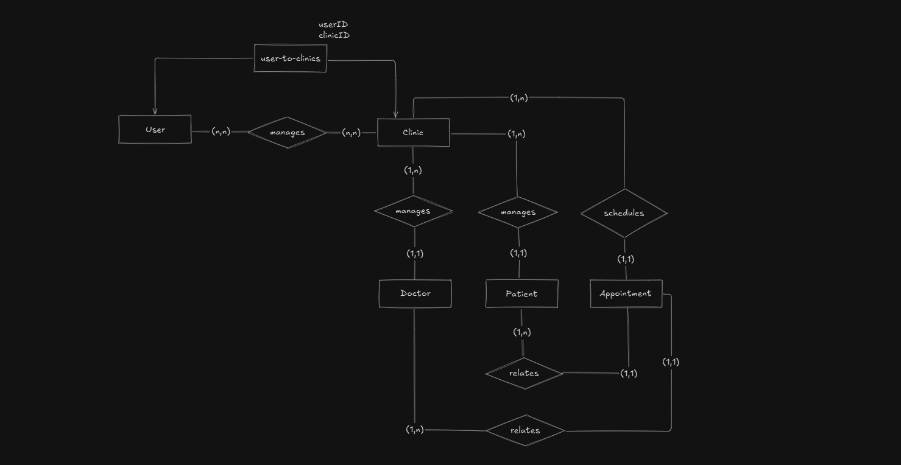

# saas-clinical-solutions 💊

## About ℹ️

A web app concept for clinical/health solutions. Designed for:

- clinical access:
  - medics and pacients registration
  - appointment scheduling
- medics access:
  - pacients medical history (e.g. exams)
  - AI agent for retrieving historical data
  - AI agent for data recording during consultation

## Functional requirements ⚙️

- Authentication
  - User can have multiple clinics (ex: sigle clinic for essential plan, multiple ones for business plan)
- The Clinic entity must be able to manage the medics $\rightarrow$ CRUD: create/read/update/delete
  - Medics must have: availability, consultation fee
- The Clinic entity must be able to manage patients $\rightarrow$ CRUD: create/read/update/delete
  - Patients must have: name, email, phone number, sex
- The Clinic entity must be able to manage appointments
- Subscription plans

## ER Diagram 🧩

---
